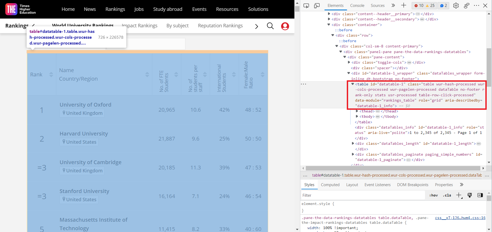
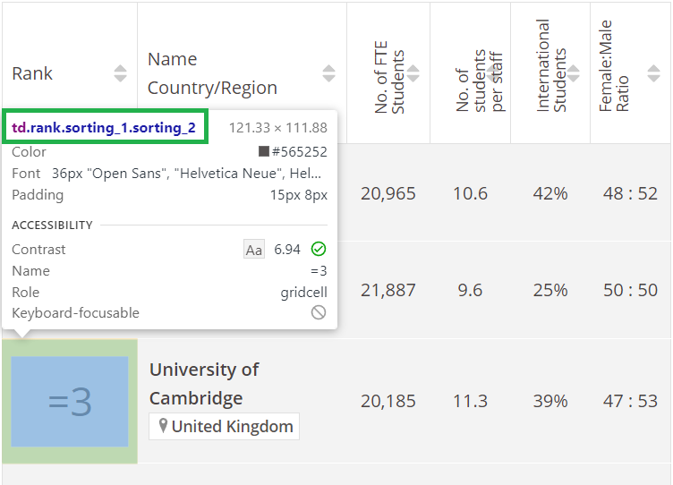

[^header]: Created by [@kztera](https://github.com/kztera) and [@IrisLe2003](https://github.com/IrisLe2003) on 20/04/2023
[^header]: Repo made for weekly exercises for CS321

<h1>World University Rankings</h1>

> Thu thập, phân tích và trực quan hóa dữ liệu từ timeshighereducation.com về Xếp hạng Đại học Thế giới

<h2> Table of Contents </h2>

- [1. Xác định mục tiêu / Goal](#1-xác-định-mục-tiêu--goal)
- [2. Requirements / Yêu cầu](#2-requirements--yêu-cầu)
- [3. Setup / Cài đặt](#3-setup--cài-đặt)
- [4. References / Nguồn tham khảo](#4-references--nguồn-tham-khảo)
- [5. How I did it? / Chúng tôi đã làm như thế nào?](#5-how-i-did-it--chúng-tôi-đã-làm-như-thế-nào)
  - [5.1. Ideas / Ý tưởng](#51-ideas--ý-tưởng)
  - [5.2. TODO](#52-todo)
- [6. Explain step by step / Giải thích từng bước](#6-explain-step-by-step--giải-thích-từng-bước)
  - [6.1. Dữ liệu mà chúng ta sẽ lấy / The data we will collect](#61-dữ-liệu-mà-chúng-ta-sẽ-lấy--the-data-we-will-collect)
  - [6.2. Phân tích cấu trúc và tìm kiếm giải pháp / Analyze structure and search for solutions](#62-phân-tích-cấu-trúc-và-tìm-kiếm-giải-pháp--analyze-structure-and-search-for-solutions)
  - [6.3. Lấy dữ liệu / Get data](#63-lấy-dữ-liệu--get-data)
  - [6.4. Tạo dataframe lưu dữ liệu / Create dataframe to save data](#64-tạo-dataframe-lưu-dữ-liệu--create-dataframe-to-save-data)
  - [6.5. Làm sạch dữ liệu / Clean data](#65-làm-sạch-dữ-liệu--clean-data)
  - [6.6. Xuất dữ liệu ra file csv / Export data to csv file](#66-xuất-dữ-liệu-ra-file-csv--export-data-to-csv-file)
- [7. Phân tích dữ liệu / Data analysis](#7-phân-tích-dữ-liệu--data-analysis)

## 1. Xác định mục tiêu / Goal

Dữ liệu được lấy từ:

- **Times Higher Education - World University Rankings:** https://www.timeshighereducation.com/world-university-rankings/2023/world-ranking

## 2. Requirements / Yêu cầu

- [Beautiful Soup](http://www.crummy.com/software/BeautifulSoup/bs4/), và [JSON](https://docs.python.org/3/library/json.html) cho việc lấy dữ liệu, phân tích và trích xuất dữ liệu
- [Selenium](https://selenium-python.readthedocs.io/) cho việc điều khiển trình duyệt tự động cũng như tạo cơ hội cho code Js chạy
- [pandas](https://pandas.pydata.org/) và [numpy](https://numpy.org/) cho việc xử lý dữ liệu

## 3. Setup / Cài đặt

```bash
python -m venv env
env/bin/activate.bat
pip install -r requirements.txt
python main.py
```

## 4. References / Nguồn tham khảo

- [lkuffo/web-scraping](https://github.com/lkuffo/web-scraping)
- [KateMzz/UUniversity_ranks](https://github.com/KateMzz/University_ranks)
- [lauren-safwat/World-University-Rankings-Dashboard](lauren-safwat/World-University-Rankings-Dashboard)
- [Minglokyam/University_rankings](https://github.com/Minglokyam/University_rankings)
- [razekmh/World-University-Rankings-Table](https://github.com/razekmh/World-University-Rankings-Table)
- [glhr/dash-university-rankings](https://github.com/glhr/dash-university-rankings)
- [Unicorn Company Web Scraping Tutorial Using Python Beautiful Soup](https://www.youtube.com/@havingfunwithdata.88/playlists)

## 5. How I did it? / Chúng tôi đã làm như thế nào?

### 5.1. Ideas / Ý tưởng

Ý tưởng ban đầu là lấy dữ liệu từ trang `timeshighereducation.com` về Thứ tự xếp hạng các trường đại học trên toàn thế giới.

Khi có được dữ liệu thô, chọn một định dạng lưu trữ dữ liệu phù hợp và sau đó thực hiện phân tích và đồ thị hóa dữ liệu.

Và cuối cùng là nếu vẫn còn thời gian sẽ thực hiện việc tạo app dashboard để hiển thị dữ liệu.

<details>
<summary>English</summary>

The original idea was to get data from `timeshighereducation.com` for the Ranking of World Universities.

Once the raw data is obtained, select an appropriate data storage format and then perform data analysis and graphing.

And finally, if there is still time, I will create a dashboard app to display data.

</details>

### 5.2. TODO

- [x] Phân tích cấu trúc cây của trang web `timeshighereducation.com`
- [x] Thực hiện lấy dữ liệu
  - [x] Request webpage: webdriver
  - [x] Collect + parse data: BeautifulSoup
  - [x] Lọc lấy những object cần thiết(ở đây là nội dung thuộc tag `<table>`): BeautifulSoup
- [x] Lựa chọn định dạng lưu trữ dữ liệu phù hợp: JSON, CSV, Excel
- [ ] Phân tích và đồ thị hóa dữ liệu

<details>

<summary>English</summary>

- [x] Analyze the structure of the `timeshighereducation.com` web page
- [x] Perform data collection
  - [x] Request webpage: webdriver
  - [x] Collect + parse data: BeautifulSoup
  - [x] Filter to get the necessary objects (in this case, the contents of the `<table>` tag): BeautifulSoup
- [x] Select an appropriate data storage format: JSON
- [ ] Data analysis and graphing

</details>

## 6. Explain step by step / Giải thích từng bước

### 6.1. Dữ liệu mà chúng ta sẽ lấy / The data we will collect

Trang web mà ta vào trông như thế này:


Dễ dàng nhận thấy thông tin chúng ta đang muốn lấy được lưu trong một bảng. Tuy nhiên việc thu thập dữ liệu lại phụ thuộc vào cấu trúc HTML ẩn đằng sau của trang web. Bấm `F12` hoặc chuôt phải chọn `Inspect` để xem cấu trúc HTML của trang web. Ta có được kết quả như dưới đây:



Sử dụng chuột trỏ vào các thành phần của trang web và ta sẽ biết được phần nào của HTML đại diện cho . Vì chúng ta sẽ làm việc với các đoạn HTML đó chứ không phải với những gì mà ta thấy được hiển thị đẹp đẽ trên trình duyệt. Khi đã xác định được phần HTML tương ứng với thông tin cần. Chúng ta sẽ bắt đầu việc "cào" dữ liệu.

<details>
<summary>English</summary>

The web page looks like this:


It is easy to see that the information we are looking for is stored in a table. However, the collection of data depends on the HTML structure behind the web page. Press `F12` or right-click `Inspect` to view the HTML structure of the web page. We get the following result:


Use the mouse to point to the elements of the web page and we will know which part of the HTML represents. Because we will work with those HTML segments rather than what we see displayed beautifully on the browser. When we have identified the HTML corresponding to the information needed. We will start "crawling" data.

</details>

### 6.2. Phân tích cấu trúc và tìm kiếm giải pháp / Analyze structure and search for solutions

Một phương pháp rất thường gặp và phổ biến là sử dụng `requests` để lấy được trang web. Tuy nhiên web này lại sử dụng `AJAX` để load dữ liệu. Ta có thể kiểm tra hoặc nhận ra bằng cách theo dõi các biến và tham số xuất hiện trong thanh địa chỉ mỗi khi thực hiện nhấn nút hoặc điền kết quả vào biểu mẫu nào đó. Điều này có nghĩa là HTML mà chúng ta có được nếu sử dụng `request` sẽ chỉ là một bảng `<table>` rỗng và không chứa thông tin mà chúng ta muốn lấy. Để tạo cơ hội cho mã Js chạy và load dữ liệu vào bảng, chúng ta sẽ sử dụng `Selenium` cùng với trình duyệt để lấy được cả trang web và chúng ta sẽ lấy HTML sau khi trang web đã được load hoàn toàn, điều này sẽ giúp chúng ta có được đầy đủ thông tin cần.

```python
from selenium import webdriver
from bs4 import BeautifulSoup as bs
```

`Selenium` yêu cầu một `webdriver` để truy cập trình duyệt và điều khiển. Nó có thể được cài đặt bằng thư viện bên thứ 3. Việc này sẽ chắc chắn rằng chúng ta có được đúng chính xác driver cần thiết cho trình duyệt:

```python
from webdriver_manager.chrome import ChromeDriverManager

service = ChromeService(executable_path=ChromeDriverManager().install())

driver = webdriver.Chrome(service=service)
```

Một cách khác mà chúng ta có thể dùng chính là tải xuống thủ công và đặt nó vào cùng với thư mục chứa mã python (việc tạo và đặt nó một thư mục khác cũng được) và chỉ định đường dẫn tới nó:

```python
webdriver_path = 'D:\Documents\giaoTrinh\nam_2\ki-3\nhap-mon-khoa-hoc-du-lieu\university-ranking\chromedriver.exe'

web_driver = webdriver.Chrome(executable_path=webdriver_path)
```

Nếu muốn sử dụng trình duyệt khác, bạn có thể tham khảo link download tại [đây](https://www.selenium.dev/documentation/webdriver/getting_started/install_drivers/#quick-reference).

Tuy nhiên từ Selenium4 trở đi, `executable_path` đã không còn được sử dụng nữa. Thay vào đó, chúng ta sẽ sử dụng `service` để chỉ định đường dẫn tới `webdriver`:

````python
from selenium.webdriver.chrome.service import Service

service = Service(executable_path=webdriver_path)

Sau khi đã có được `webdriver`, chúng ta cần xác định những địa chỉ web sẽ sử dụng. Kiểm tra nhanh địa chỉ web mục tiêu cho thấy việc thay đổi giá trị tham số `length` thành `-1` sẽ dẫn đến việc có được trang web chứa tất cả các trường đại học thay vì chỉ 25 trên mỗi trang web như những gì mặc định mà ta thấy ở bên trên. Bên cạnh đó, bảng xếp hạng còn được chia thành 2 tab `Socre` và `Ranking` với nhiều dữ liệu hơn. Chúng ta sẽ lấy dữ liệu từ cả 2 tab này.

```python
url_score = 'https://www.timeshighereducation.com/world-university-rankings/2023/world-ranking#!/page/0/length/-1/sort_by/rank/sort_order/asc/cols/scores'

url_stats = 'https://www.timeshighereducation.com/world-university-rankings/2023/world-ranking#!/page/0/length/-1/sort_by/rank/sort_order/asc/cols/stats'
````

<details>
<summary>English</summary>

A very common and popular method is to use `requests` to get the web page. However, this web uses `AJAX` to load data. We can check or recognize by tracking the variables and parameters that appear in the address bar each time we press the button or enter the result into some form. This means that the HTML we get if we use `request` will only be an empty `<table>` and will not contain the information we want to get. To create an opportunity for the Js code to run and load data into the table, we will use `Selenium` with the browser to get the whole web page and we will get the HTML after the web page has been fully loaded, which will help us get all the information we need.

```python
from selenium import webdriver
from bs4 import BeautifulSoup
```

`Selenium` requires a `webdriver` to access the browser and control it. It can be installed by a third-party library. This will ensure that we have exactly the right driver for the browser:

```python
from webdriver_manager.chrome import ChromeDriverManager

service = ChromeService(executable_path=ChromeDriverManager().install())

driver = webdriver.Chrome(service=service)
```

Another way we will use this time is to manually download and place it in the same folder as the python code (creating and placing it in a different folder is also fine) and specify the path to it:

```python
webdriver_path = 'D:\Documents\giaoTrinh\nam_2\ki-3\nhap-mon-khoa-hoc-du-lieu\university-ranking\chromedriver.exe'

web_driver = webdriver.Chrome(executable_path=webdriver_path)
```

If you want to use a different browser, you can refer to the download link [here](https://www.selenium.dev/documentation/webdriver/getting_started/install_drivers/#quick-reference).

After we have the `webdriver`, we need to determine which web addresses we will use. Quickly checking the target web address shows that changing the `length` parameter value to `-1` will lead to a web page containing all the universities instead of only 25 on each web page as we see by default. In addition, the ranking table is also divided into 2 tabs `Socre` and `Ranking` with more data. We will get data from both of these tabs.

```python
url_score = 'https://www.timeshighereducation.com/world-university-rankings/2023/world-ranking#!/page/0/length/-1/sort_by/rank/sort_order/asc/cols/scores'

url_stats = 'https://www.timeshighereducation.com/world-university-rankings/2023/world-ranking#!/page/0/length/-1/sort_by/rank/sort_order/asc/cols/stats'
```

Knowing that there are 2 urls to get data, create 2 `webdriver`:

</details>

### 6.3. Lấy dữ liệu / Get data

Với mỗi `webdriver`, ta thực hiện quy trình tương tự nhau:

- Load trang web bằng `webdriver` vừa tạo
- Thu thập code HTML của web
- Sử dụng `BeautifulSoup` để `parse` HTML
- Sử dụng `find_all` để lấy được tất cả các đối tượng mà ta đã xác định là cần thiết

Ví dụ việc xác định đối tượng, sử dụng `Inspect` của trình duyệt và chọn đối tượng cần lấy dữ liệu:



Dễ dàng nhận thấy đối tượng cần lấy thuộc tag `td` và có class là `rank sorting_1 sorting_2`. Làm tương tự với các cột còn lại.

```python
web_driver_stats = webdriver.ChromiumEdge(service=service)
web_driver_stats.get(url_stats)

# Đợi cho đến khi tất cả các phần tử được tải
web_driver_stats.implicitly_wait(10)

# Lấy code HTML của trang web
stats_html = web_driver_stats.page_source

# Parse HTML
stats_soup = bs(stats_html, 'html.parser')

# Lấy các đối tượng cần thiết
uni_stats_rank = stats_soup.find_all('td', {'class':'rank sorting_1 sorting_2'})
uni_name = stats_soup.findAll("a", {"class":"ranking-institution-title"})
uni_country = stats_soup.findAll("div", {"class":"location"})
uni_stats_number_students = stats_soup.findAll("td", {"class":"stats stats_number_students"})
uni_stats_students_per_staff = stats_soup.findAll("td", {"class":"stats stats_student_staff_ratio"})
uni_stats_international_students = stats_soup.findAll("td", {"class":"stats stats_pc_intl_students"})
uni_stats_female_male_ratio = stats_soup.findAll("td", {"class":"stats stats_female_male_ratio"})
uni_location = stats_soup.findAll("div", {"class":"location"})

# Đóng trình duyệt
web_driver_stats.close()
```

```python
# Load webpage
web_driver_score.get(url_score)

# Đợi cho đến khi tất cả các phần tử được tải
web_driver_score.implicitly_wait(10)

# Lấy code HTML của trang web
score_html = web_driver_score.page_source

# Parse HTML
score_soup = bs(score_html, 'html.parser')

# Lấy các đối tượng cần thiết
# Vì thứ tự của các trường giống với `rank` nên ta chỉ cần bắt đầu lấy từ cột thứ 3

uni_overall_score = score_soup.findAll("td", {"class":"scores overall-score"})
uni_teaching_score = score_soup.findAll("td", {"class":"scores teaching-score"})
uni_research_score = score_soup.findAll("td", {"class":"scores research-score"})
uni_citations_score = score_soup.findAll("td", {"class":"scores citations-score"})
uni_industry_income_score = score_soup.findAll("td", {"class":"scores industry_income-score"})
uni_international_outlook_score = score_soup.findAll("td", {"class":"scores international_outlook-score"})

# Đóng trình duyệt
web_driver_score.close()
```

Một khi đã có được các đối tượng HTML, ta có thể bắt đầu trích xuất dữ liệu từ chúng. Sử dụng pandas để tạo dataframe và có thể xuất dữ liệu ra file csv, excel, json, ...

<details>

<summary>English</summary>

With each `webdriver`, we perform the same process:

- Load the web page with the `webdriver` just created
- Collect the HTML code of the web
- Use `BeautifulSoup` to `parse` HTML
- Use `find_all` to get all the objects that we have identified as necessary

For example, determining the object, using the `Inspect` of the browser and selecting the object to get data:


It is easy to see that the object to be collected belongs to the tag `td` and has the class `rank sorting_1 sorting_2`. Do the same for the remaining columns.


Once we have the HTML objects, we can start extracting data from them. Use pandas to create a dataframe and export data to csv, excel, json, ...

</details>

### 6.4. Tạo dataframe lưu dữ liệu / Create dataframe to save data

Trước đó thì việc đầu tiên là tạo một dataframe rỗng, sau đó thêm các cột vào dataframe.

```python
import pandas as pd

# stats
rank, names, countries, number_students, student_staff_ratio, intl_students, female_male_ratio = [], [], [], [], [], [], []

# score
overall_score, teaching_score, research_score, citations_score, industry_income_score, international_outlook_score = [], [], [], [], [], []

for i in range(len(uni_name)):
  names.append(uni_name[i].text)
  rank.append(uni_stats_rank[i].text)
  countries.append(uni_country[i].text)
  number_students.append(uni_stats_number_students[i].text)
  student_staff_ratio.append(uni_stats_students_per_staff[i].text)
  intl_students.append(uni_stats_international_students[i].text)
  female_male_ratio.append(uni_stats_female_male_ratio[i].text)
  overall_score.append(uni_overall_score[i].text)
  teaching_score.append(uni_teaching_score[i].text)
  research_score.append(uni_research_score[i].text)
  citations_score.append(uni_citations_score[i].text)
  industry_income_score.append(uni_industry_income_score[i].text)
  international_outlook_score.append(uni_international_outlook_score[i].text)

df = pd.DataFrame({
  'Rank': rank,
  'Name': names,
  'Country': countries,
  'Number of Students': number_students,
  'Student Per Staff': student_staff_ratio,
  'International Students': intl_students,
  'Famale Male Ratio': female_male_ratio,
  'Overall Score': overall_score,
  'Teaching Score': teaching_score,
  'Research Score': research_score,
  'Citations Score': citations_score,
  'Industry Income Score': industry_income_score,
  'International Outlook Score': international_outlook_score
})
```

<details>

<summary>English</summary>

Previously, the first thing to do is to create an empty dataframe, then add columns to the dataframe.

```python
[code above here]
```

</details>


### 6.5. Làm sạch dữ liệu / Clean data

Dễ nhận thấy có nhiều trường đại học có giá trị cột rank là `Reporter` thay vì một số cụ thể nào đó. Theo một bài đăng từ chính `timeshighereducation.com` vào tháng 9/2021 mà bạn có thể đọc ở [đây](https://www.timeshighereducation.com/world-university-rankings/why-we-are-including-reporter-institutions-our-world-university-rankings) thì:

```text
[...] so this year we have created a new “reporter” status for them. This status indicates that they are active participants in the rankings process, even though they have not been ranked this year.

Practically, this means that they are listed, alphabetically, at the end of the rankings table, and rather than being assigned a rank number, they are instead labelled reporter institutions.
```

Dịch bởi GG Translate:

```text
[...] vì vậy năm nay chúng tôi đã tạo một trạng thái "báo cáo" mới cho họ. Trạng thái này chỉ ra rằng đó là những  tham gia tích cực trong quá trình xếp hạng, ngay cả khi họ không được xếp hạng trong năm nay.
Trên thực tế, điều này có nghĩa là chúng được liệt kê, theo thứ tự bảng chữ cái, ở cuối bảng xếp hạng và thay vì được gán một số thứ hạng, thay vào đó chúng được dán nhãn là các tổ chức báo cáo.
```

Vì vậy, ta sẽ loại bỏ các giá trị `Reporter` trong cột `rank` và chỉ giữ lại các giá trị còn lại

Tiếp đó, ta sẽ loại bỏ kí tự `%` để có thể chuyển cột `international_students` thành kiểu dữ liệu số.

Dễ nhận thấy cột `Rank` có một số kiểu giá trị như sau:

- `=3` (có dấu `=`) là giá trị của các trường đại học có cùng rank
- `101-150` (có dấu `-`) là giá trị của các trường đại học có cùng rank từ 101 đến 150
- `1501+` (có dấu `+`) là giá trị của các trường đại học có cùng rank từ 1501 trở lên

Ta sẽ loại bỏ các kí tự `=`, và `+`, riêng những giá trị có `-` ta sẽ chỉ lấy tới trước dấu `-` để có thể chuyển cột `rank` thành kiểu dữ liệu số.

Điều này cũng xảy ra ở cột `Overall_score`.

Và cuối cùng là sự xuất hiện của các giá trị `n/a` trong các cột, ta cần thay thế chúng bằng giá trị NaN của thư viện `numpy`.

```python
# loại bỏ các giá trị 'Reporter' trong cột 'Rank'
df = df[df['Rank'] != 'Reporter']
# loại bỏ kí tự '%' trong cột 'International Students'
df.loc[:,'International Students'] = df.loc[:,'International Students'].str.replace(pat='%', repl='')
# loại bỏ kí tự `=` trong cột 'Rank'
df.loc[:,'Rank'] = df.loc[:,'Rank'].str.replace(pat='=', repl='')
# loại bỏ kí tự `-` và những kí tự trước đó của cột overall score
df.loc[:,'Overall Score'] = df.loc[:,'Overall Score'].str.replace(pat='.*\–', repl='', regex=True)
# loại bỏ kí tự `-` và những kí tự sau đó của cột 'Rank' và loại bỏ kí tự `+`
df.loc[:,'Rank'] = df.loc[:,'Rank'].str.replace(pat='\–\d*|\+', repl='', regex=True)
# bỏ dấu `,` trong cột 'Number of Students'
df.loc[:,'Number of Students'] = df.loc[:,'Number of Students'].str.replace(pat=',', repl='')
```

<details>

<summary>English</summary>

It is easy to see that there are many universities with the rank column value is `Reporter` instead of a specific number. According to a post from `timeshighereducation.com` in September 2021 that you can read [here](https://www.timeshighereducation.com/world-university-rankings/why-we-are-including-reporter-institutions-our-world-university-rankings) then:

```text
[...] so this year we have created a new “reporter” status for them. This status indicates that they are active participants in the rankings process, even though they have not been ranked this year.

Practically, this means that they are listed, alphabetically, at the end of the rankings table, and rather than being assigned a rank number, they are instead labelled reporter institutions.
```

Therefore, we will remove the `Reporter` values in the `rank` column and only keep the remaining values

Next, we will remove the `%` character to be able to convert the `international_students` column to a numeric data type.

It is easy to see that the `Rank` column has some values like:

- `=3` (has `=`) is the value of universities with the same rank
- `101-150` (has `-`) is the value of universities with the same rank from 101 to 150
- `1501+` (has `+`) is the value of universities with the same rank from 1501 and above

We will remove the `=` character, and `+` character, separately, those values with `-` we will only take to before the `-` to be able to convert the `rank` column to a numeric data type.

This also happens in the `Overall_score` column.

And finally, the appearance of `n/a` values in the columns, we need to replace them with the NaN value of the `numpy` library.

```python
[...]
```

</details>

### 6.6. Xuất dữ liệu ra file csv / Export data to csv file

```python
df.to_csv('times_higher_education.csv', index=False)
```

## 7. Phân tích dữ liệu / Data analysis
